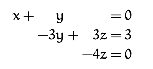
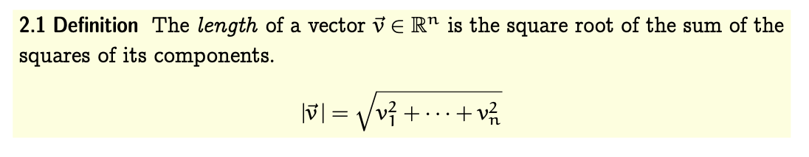
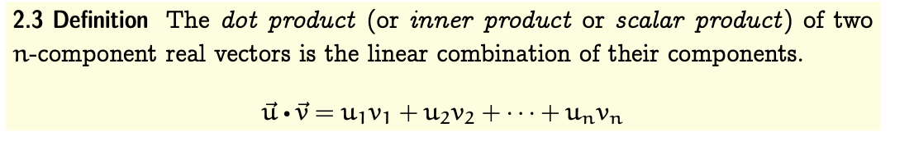
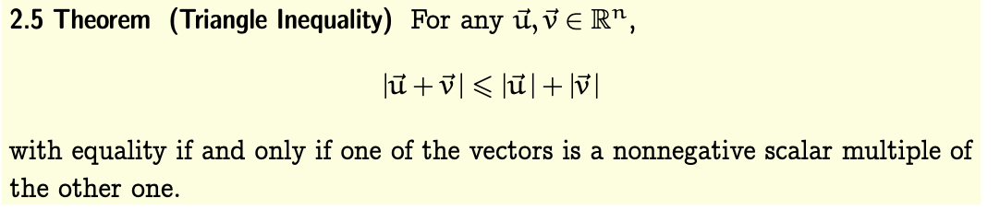
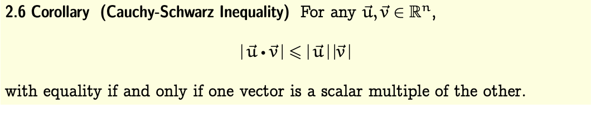
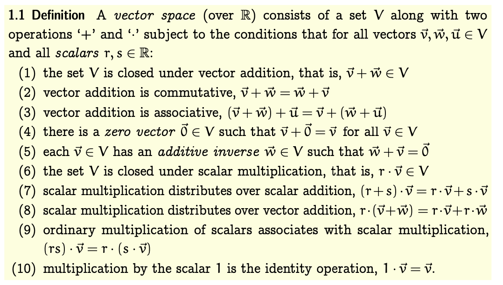

# linear algebra

## Course by Jim Hefferon

### Solving linear sytems
A **linear combination** of x1, x2, ... xn has the form a1x1 + a2x2 + ... + anxn
A **linear equation** has the form of a1x1 + a2x2 + ... + anxn = d where d is a constant. s1, s2, ..., sn is a solution (or satisfies) that equation
A system of linear equations is several equations with a tuple solution of all equations. 
Def : the first variable with a non zero coeff is the row's **leading variable**.
A system is in **echelon** form when each leading variable is to the right of the leading variable in the row above it.

3 operations of the Gauss method :  
- swap equation,   
- multiply both side of an equation by a non zero constant  
- replace by the sum of itself and a multiple of other equation  
will help to reduce the equations in order to get an echelon form.  
### describe the solution set
In an echelon form, variables that are not leading are **free**. And a variable that we use to describe a family of solutions is a **parameter**. We shall parametrize linear systems with the free variables.    

### matrix
A **matrix** is a rectangular array of numbers. Each number in a matrix is an entry. Notation : row,col   
The number of rows is alays stated first.   
A **column vector** (or a vector) is a matrix with a single column. A row vector is a matrix with a signle row. Entries of a vector are sometimes called components.  
**Scalar multiplication and addition results** of vector are obvious   
A linear equation is **homogeneous** if it has a constant of zero.   
**Theorem** : Every linear systems has for solutions a set defined as p + c1b1 + c2b2 + .. + cnbn where p is particular solution and number of vectors b1, b2, ..., bn represent number of free variables   
If a linear system is homogeneous, a particular solution is a zero vector (so could be omitted)   
Linear systems solution sets are either empty, one solution or an infinity.  
**Def** : A square matrix is **nonsingular** if the coefficients of homogenous sytems with a unique solution. It is singular otherwise.   

### linear gemonetry
You can draw equation as lines and then thre possibiles sets becomes clear  
**def** : A **vector** consists of a magnitude and a direction     
- a vector can model a displacement  
**Scalar** multiplications makes a vector longer or shorter   
**addition** represent those displacement combined.  
a **line** could be defined by a set of 2 vectors and one is parametrrized.   
a **plane** could be defined with a vector with 2 parameters or an equations with 3 parameters  
A set of the form p +t1v1 + ..+ tjvk is a k dimensional linear surface (or k-flat)   

#### length and angle measures

##### length of a vector 

##### dot products of a vector
  
dot products of a vector is a scalar, not a vector.  

**Theorem** : triangle inequality  

  
“The shortest distance between two points is in a straight line.”    

** Cauchy-Schwarz inequality**

   

**Angle between vectors**
angle = arccos( (u*v)/(lu*lv))  
Proof : law of cosines  
Orthogonal : vectors are othogonal only if their products is zero  

#### other reduction method

**Gauss Jordan reduction** :   
- making the leading entries into 1’s  
- uses the leading entries to eliminate all of the other entries in each column by combining upwards  

Every row operation is reversible  

**Def** : a matrix or linear system is in **reduced echelon form** if, in addition to being in echelon form, each leading entry is a 1 and is the only nonzero entry in its column.  

Between matrices, ‘reduces to’ is an equivalence relation.   
**Definition** Two matrices that are interreducible by elementary row operations are **row equivalent**.  

**Linear equation lemma**   
A linear combination of linear combinations is a linear combination  

In an echelon form matrix, no nonzero row is a linear combination of the other nonzero rows.  

**Theorem** Each matrix is row equivalent to a unique reduced echelon form matrix.  

To decide if two matrixes are equivalent, you could reduce to reduced echelon form.   

### Vector space definition

Example : vectors dim 2 with slope 2 is a vector space.

## Appendix

**Relations** Some familiar mathematical things, such as ‘<’ or ‘=’, are most naturally understood as relations between things.   
A binary relation on a set A is a set of ordered pairs of elements of A. For example, some elements of the set that is the relation ‘<’ on the integers are (3,5), (3,7), and (1,100). Another binary relation on the integers is equality; this relation is the set { . . . , (−1, 1), (0, 0), (1, 1), . . . }. Still another example is ‘closer than 10’, the set {(x,y)||x−y|<10}. Somemembersofthisrelationare(1,10),(10,1),and (42, 44). Neither (11, 1) nor (1, 11) is a member.  
Those examples illustrate the generality of the definition. All kinds of relationships (e.g., ‘both numbers even’ or ‘first number is the second with the digits reversed’) are covered. 

**Equivalence Relations** We shall need to express that two objects are alike in some way. They aren’t identical, but they are related (e.g., two integers that give the same remainder when divided by 2).  
A **binary relation** {(a,b),...} is an equivalence relation when it satisfies   
- reflexivity: any object is related to itself, 
- symmetry: if a is related to b then b is related to a, and 
- transitivity: if a is related to b and b is related to c then a is related to c.   
Some examples (on the integers): ‘=’ is an equivalence relation, ‘<’ does not satisfy symmetry, ‘same sign’ is a equivalence, while ‘nearer than 10’ fails transitivity.

