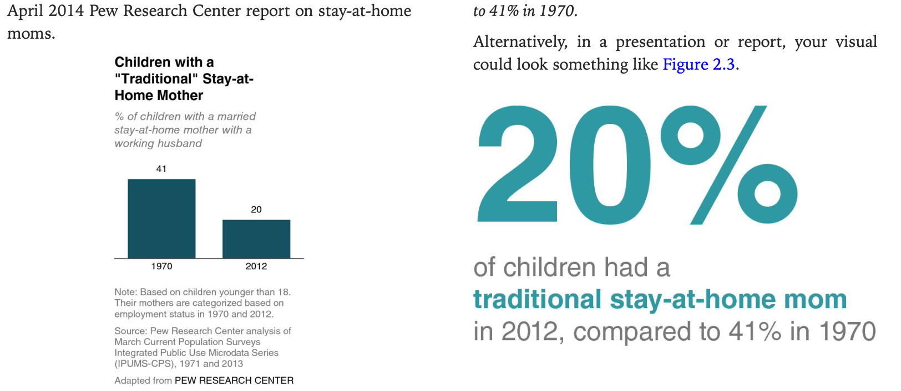
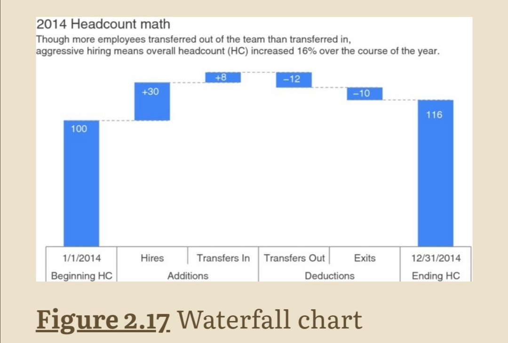
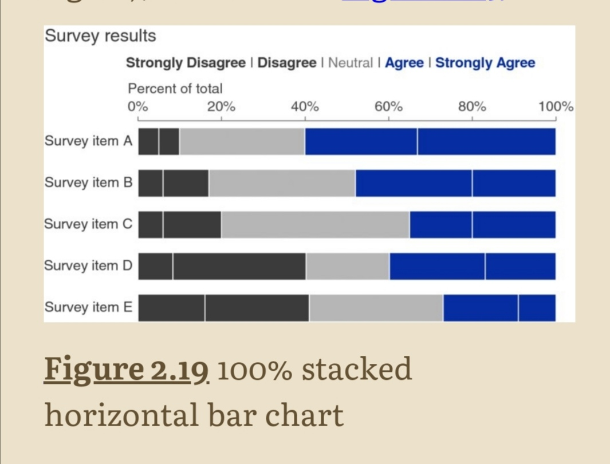
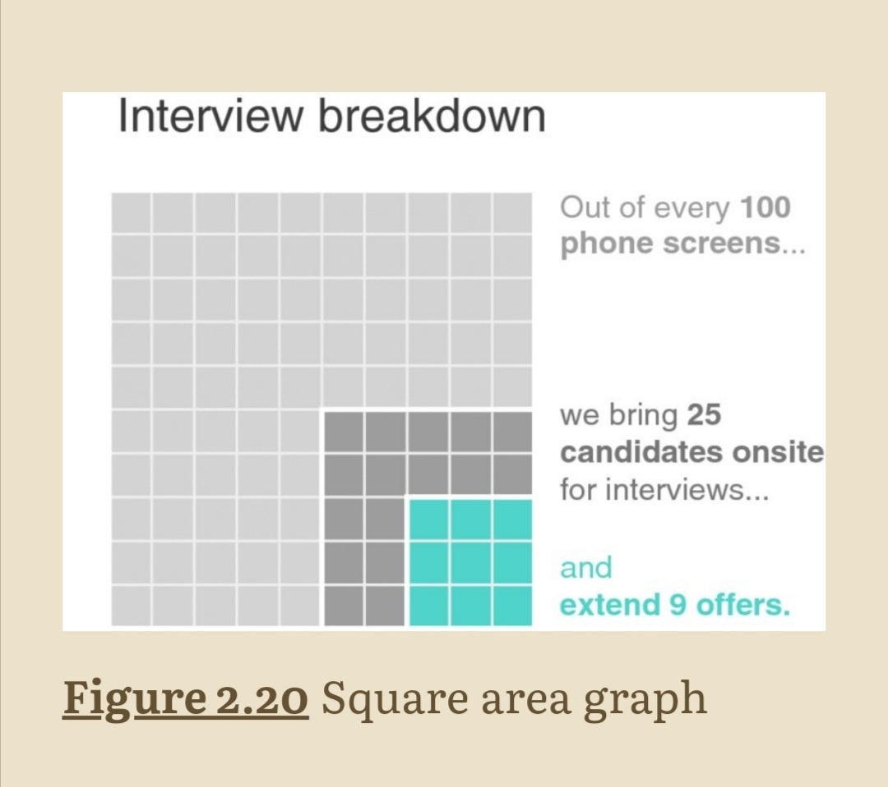
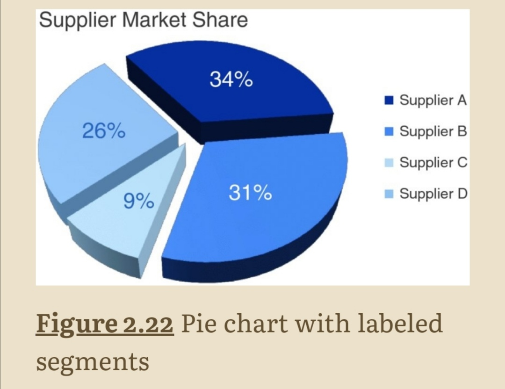
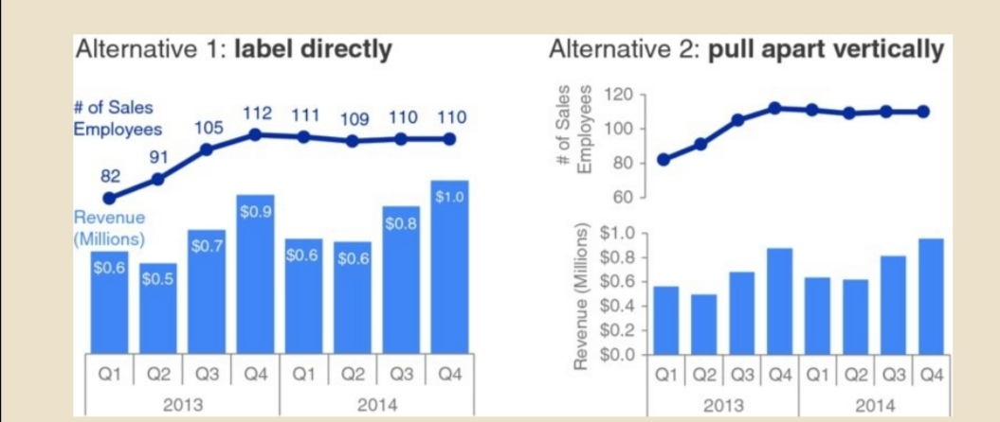
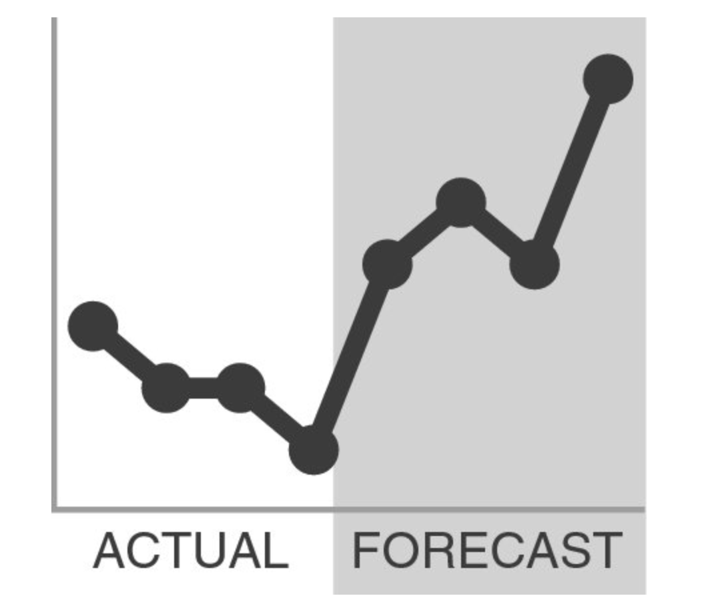
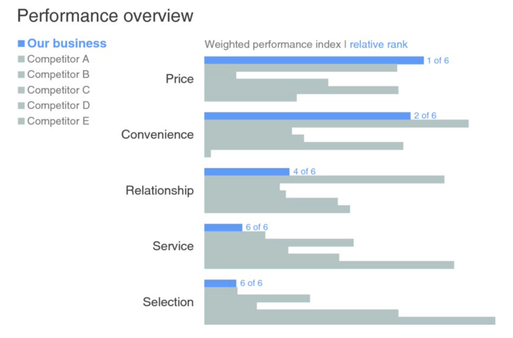
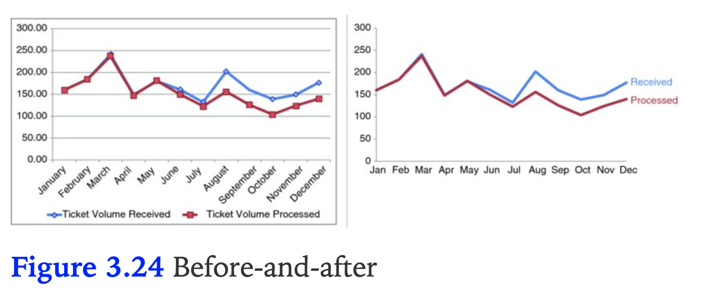
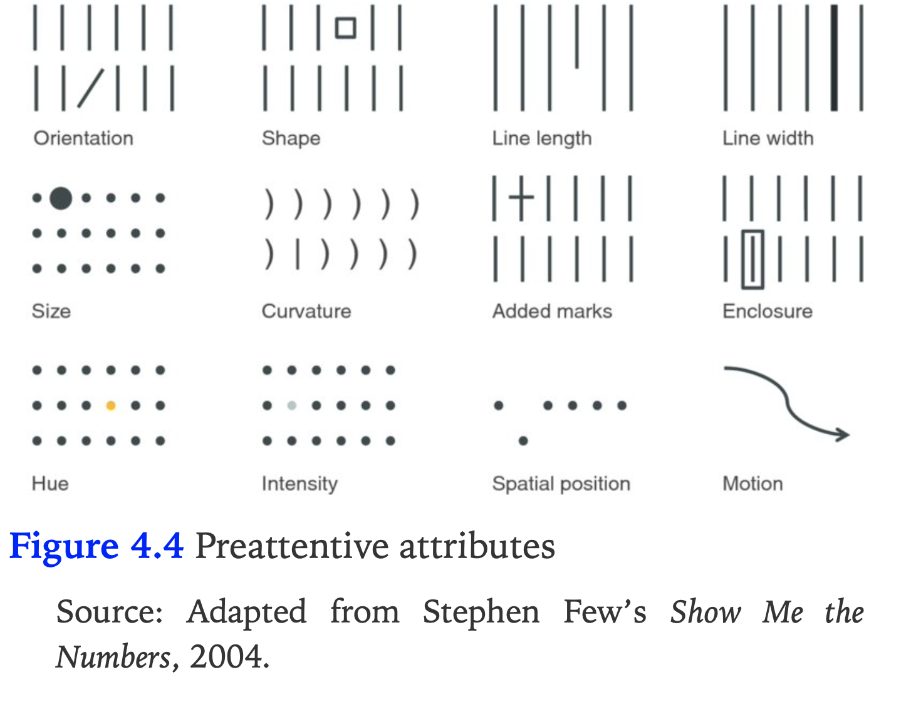

# Storytelling with data by Cole Nussbaumer Knaflic

 

Introduction

Pas d’éducation sur la data viz pourtant c’est une compétence clé pour transformer des données en aide à la décision  
Auteurs ont travaillé sur la partie Data dans les HR (projet oxygen) : Google veut être data même dans les HR.   
Liens : [https://www.storytellingwithdata.com/books](https://www.storytellingwithdata.com/books)

Chapter 1 : the importance of context

# Exploratory vs explanatory testing
**Exploratory** phase : figure out what is interesting in datas - like hunting pers in oysters
**Explanatory** space : communication of the analysis
Exploratory space shouldn’t be shown. This book focus only on **explanatory**

# Who
Your audience : try to narrow your target audience to have better efficiency
Your relationship with the audience : do they trust you as an expert ?

# What
What you want your audience to know ? 
Even if you recommend or prompt the wrong thing, it prompts the conversation focused on action. 

# How
Communication couldn’t be the same between audience.

# Questions to ask for context
Deliverable you’re creating is at the request of someone else.

- What background info is relevant ?
- What is the target audience ?
- What biases does our audience make them supportive or resistant ?
- What data is availible that would strengthen our case ?
- Where are the risks ?
- What a successfult outcome look like ?
- If you have a single sentence to tell your audience, what should you say  ?
- 3 minute story & big idea

Summarize the most important message in less than 3 minutes : help when meeting with your boss or any situation shorter. 
Big idea : summarize in one single sentence

Chapter 2 : choosing an effective visual

Author use only a dozen of different types of visuals : 

## Simple text
Simple text : when you have 1 or 2 numbers use a simple text 

## Table
- if you need to communicate multiple different units of measure it’s easier with a table.
- using a table in a live presentation isn’t a good idea : as audience reads it, you lose their ears.
- use light or no borders to focus attention on data
- heatmap : use color saturation to provide visual cues of potential point of interests

##Graphs
Well designed graphs get the info across more quickly than a well-designed table

### Points
Scatterplots useful for showing relationship between 2 things. Most used in scientific area. 

### Lines

#### Line graphs
Line graphs are used to display continuous data. Make no sense for categorical datas. You could have :
- several series
- Display min, max and avg

#### Slopegraph
Slopegraphs can be useful when you have two time periods or points of comparison and want to quickly show relative increases and decreases or differences across various categories between the two data points.

### Bars

#### Very Common
Bar charts should be leveraged because they are common : it takes less brain power to your audience to understand it

#### Baseline
Because how bar charts compare bars, it’s important baseline starts at zero (or it’s a false comparison). Do not apply to line charts (since it focus on relative position) but be clear to baseline is not zero. 

#### Label or axis ?
Choice to label data charts and remove axis depend on intention. If you want to give a big picture, keep the axis. If data values are important, use only labels.  

#### Bar width
Bars should be wider than white space between bars. But if too wide, audience could compare area instead of height
#### Types of bar charts

##### Vertical bar chart
Or column chart. It's plain vanilla bat chart. 
Could be multi series but use it with caution. Choose carefully category’s order
##### Stacked vertical bar chart
Usage more limited
You can only compare the bottom serie (the one attached to the X axis)
Could represent percentage or absolute value (but be sure to include also absolute value if percentage is choosen)
##### Waterfall chart
- Pull apart pieces of a stacked bar chart
- Show a starting point, increase, decrease and resulting end point
Could be reproduced by a stacked vertical bar chart with a not visible first serie

##### Horizontal bar chart
Most simple go-to graph.
Easy to read :
- If category names are long
- Fit to the way we process info, from left to right

- Area
Avoid in general area graph, a humans, don't evaluate well areas but could useful when need to compare values of different magnitudes…

### Pie charts and 3d are evils
People aren’t good to evaluate angle and area, pie charts should be replaced by vertical pie chart. 
Donuts are also evil, people have to compare arc values. 

Best is bar chart, ordered from greatest to least (or ordering of categoryif it has a sense). 
### Usage of multi series graph
Don’t use it : it takes too much time to be read
Strategy :
- Label the data points
- Split the graph
- Use color (same for axis and data points) but color could be used in a more useful manner

When you display two datasets on same axis, you imply a relationship between the twos. 

            

 Chapter 3 : clutter is your enemy

# Cognitive load
Cognitive load : mental effort required to learn new information
Every element take cognitive load, so it should bring max cognitive value. 
Example slides over complicated, you decide not to read them. 
In his book The Visual Display of Quantitative Information, Edward Tufte refers to maximizing the data-ink ratio, saying “the larger the share of a graphic’s ink devoted to data, the better (other relevant matters being equal).”
# Clutter
Element that take space but don't increase understanding

## Gestalt principles of visual perception
- proximity : people see elements which are close as a group
- similarity : Objects of similar color, shape, size or orientation are perceived as related or belonging to part of a group.
- enclosure : draw a visual distinction

- closure: people like things to fit in the constructs already in our head
- continuity : our eyes sees naturally create continuity. Example : we could remove Y axis
- connection : we see datas as groups when they're connected by a line (more stronger association than color) : example : line chart
## lack of visual order
- text left or right aligned. Text center aligned do not create clean lines
Without visual cues, user will start at upper left and their eyes will do a 'z'. 
No white space is like a presenter which doesn't do any pause.
## good use of contrast
If something very important, we want our audience to see, we should make that one thing very different from the rest.

## decluttering step by step
Scenario : you manage an IT team. In the past years, employees has left. You've heard more and more complaints.

Chapter 4 : focus your audience attention

## A brief lesson on memory
Short term memory limit is 4 chunks of memory. Dont use too much legends or colors.  
Solution : label the datas directly, 

## Preattentive attributes
Preattentive attributes : attributes which make your audience to see informations without thinkinng about it  
Useful because : 
- draw audience's attention quickly
- creating a visual hierarchy of info

Colors : Using same colors to draw attention for all graphs in same dashboard is a good practice. It prevents mental fatigue. And pay attention to person colorblind. 

chapter 5 : think like a designer

# Affordance

Good design : there's only one way to use it.

## highlight important stuff

- use bold but not italics or underline
- use uppercase for label, title or keywords
- colours : to be used sparingly
- use different size
- always use same font

## eliminate distractions

Decision of what to cut is more important than what to add
- not all data's are equally important
- when detail isn't needed summarize
- would delete this will change anything ?
- push necessary but non message impacting in the background : in light gray for example

